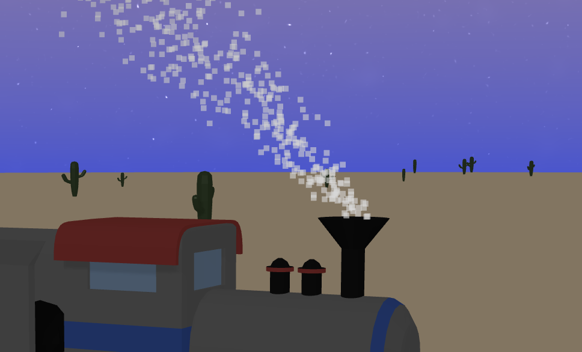
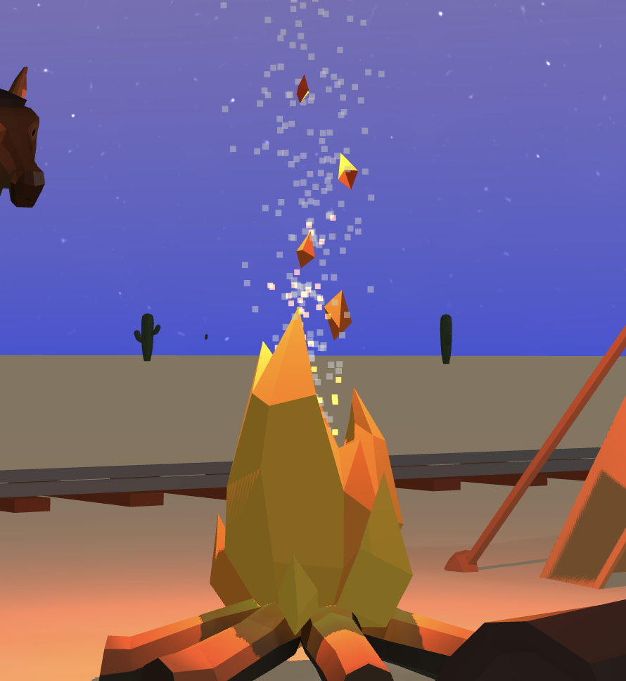
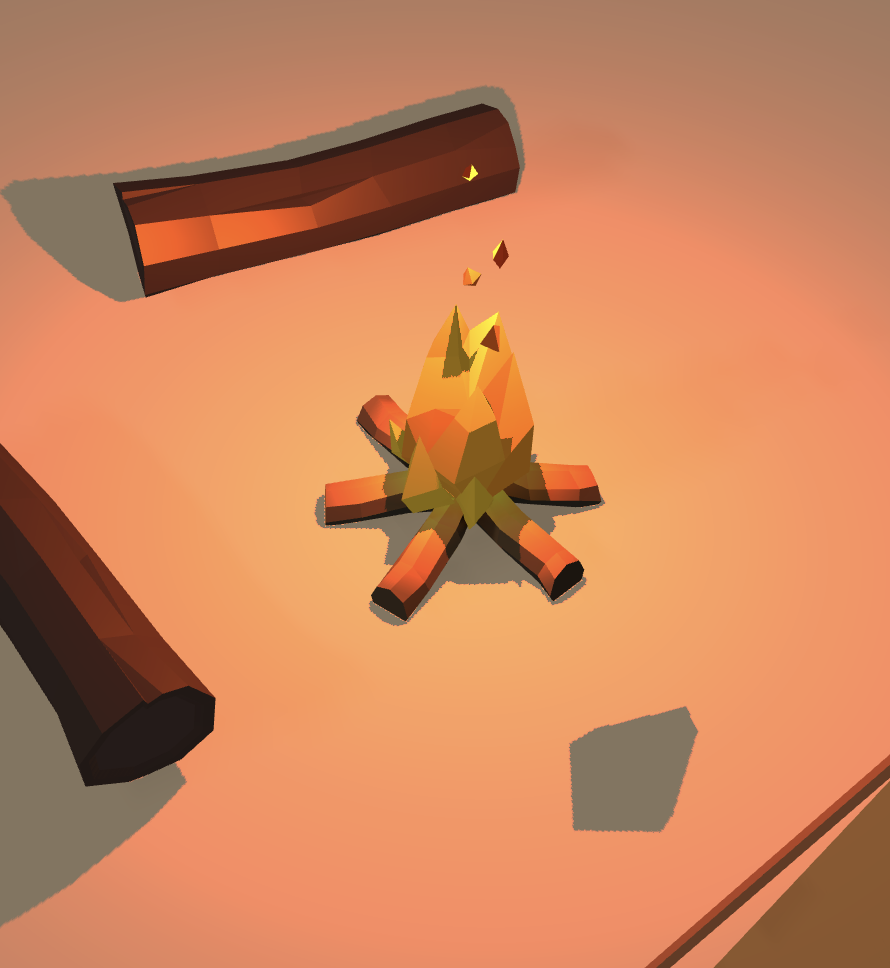
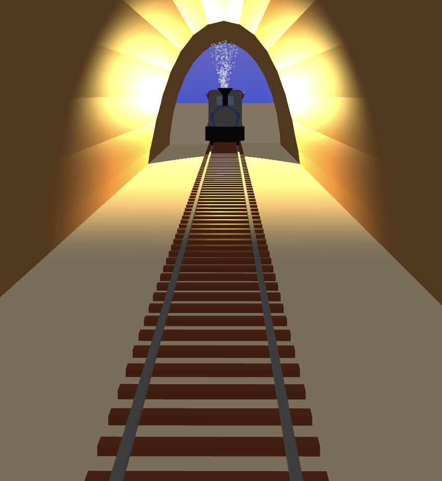
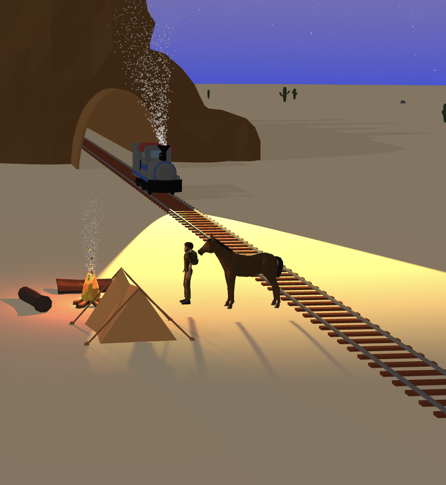
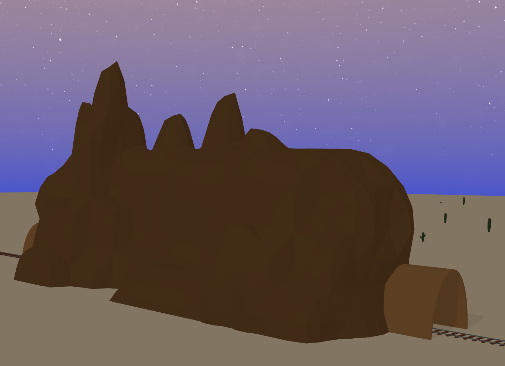
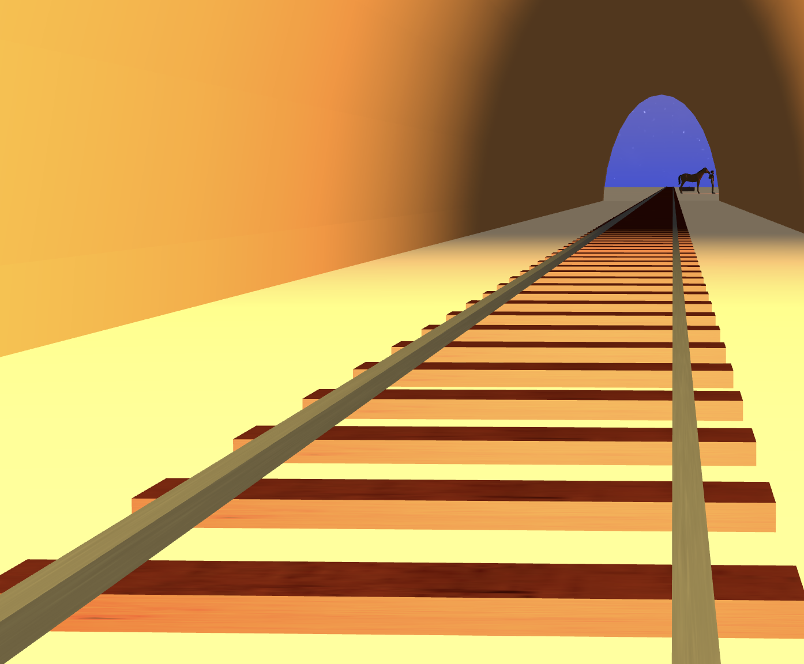

# Introduction

This project is a 3D animation movie built using Three.js.

(click on the image below to watch the video)
[](https://youtu.be/D-u03S-QeFA)

# Structure

- [Introduction](#introduction)
- [Structure](#structure) 
- [Tech Stack](#tech-stack)
  - [Three.js](#threejs)
  - [Assets & Tools](#assets--tools)
- [Overview](#overview)
- [Animation](#animation)
  - [Custom Keyframe Animation](#custom-keyframe-animation)
  - [Imported Animation](#imported-animation)
  - [Physics-based Animation](#physics-based-animation)
- [Lights](#lights)
  - [Point Light](#point-light)
  - [Spot Light](#spot-light)
  - [Ambient Light](#ambient-light)
  - [Directional Light](#directional-light)
- [Shaders](#shaders)
- [More on the cinematic through programmatic process](#more-on-the-cinematic-through-programmatic-process)
- [Modelling](#modelling)
- [Resources](#ressources)
- [To Do](#to-do)

# Tech Stack

The project is built using the following technologies.

## Three.js
[Three.js](https://threejs.org/) is the core 3D graphics library used in this project. It provides a high-level abstraction over WebGL. It basically allows to do what OpenGL does, but in JavaScript, and running in the browser.

## Assets & Tools
- [poly.pizza](https://poly.pizza/) for 3D models and animations
- [Blender](https://www.blender.org/) for 3D modeling

# Overview

The project is structured around several key components that work together to create the final cinematic.

The main application ([main.js](src/main.js)) serves as the core orchestrator, initializing and managing the overall scene, objects, renderer and game loop. At its heart is the Request Animation Frame (RAF) function which runs continuously to drive the animation forward. On each frame, it updates the components of the scene, the cinematic manager, and renders the scene while tracking timing between frames.

Object management is handled by the [`WorldManager`](src/WorldManager.js), which acts as a central hub for all objects in the 3D environment. It takes care of spawning and initializing objects like the train, horse, and adventurer, manages their positions and potential collisions, and ensures all world objects are properly updated each frame, respecting their specific behaviors. The `WorldManager` provides a clean interface for other components (like the `CinematicManager`) to trigger events on any object in the scene.

The project implements a two-level object system to handle different types of scene elements. The base [`WorldObject`](src/worldObjects/WorldObject.js) class provides core functionality for static objects, handling model loading, shadow setup, and basic position/collision management (see [Cactus.js](src/worldObjects/Cactus.js) for an example). For objects that need animation capabilities, the [`AnimatedWorldObject`](src/worldObjects/AnimatedWorldObject.js) class extends this foundation to add animation system integration, smooth transitions between different animation states, and precise control over speed and rotation of the object. Finally, behavior specific to a single object type is implemented in the respective class file, especially in the update method. Example from [Train.js](src/worldObjects/Train.js#L82):

```javascript
/*
    Train.js
*/
update(timeElapsed) 
{
    super.update(timeElapsed);

    /*
        Update position (specific to moving objects & the train). 
        The train moves forward along the tracks, which is not the case for all 
        AnimatedWorldObjects. 
        For example, Campfire.js is animated but does not move.
    */
    this.position.x += this.speed * timeElapsed;
    this.mesh.position.x = this.position.x;

    /*
        Update smoke particles (specific to the train).
    */
    this.smokeParticles.update(timeElapsed);
    this.smokeParticles.setPosition(this.position.clone().add(this.smokePositionDelta));
}
```

Orchestrating the scene's narrative flow is the [`CinematicManager.js`](src/Cinematic.js), which maintains a timeline of actions that should occur at specific moments (see the [Cinematic](#cinematic-through-programmatic-process) section). This manager coordinates camera changes, animation triggers, and other events, providing a registration system for timeline actions. It works in 2 steps: 
1. **At initialization time**: Register actions to be performed at specific moments in time
2. **At runtime**: At each frame, check if there are any actions to execute. If so, execute them in sequence.

## End-to-end example: [`Adventurer.js`](src/worldObjects/Adventurer.js)

The Adventurer object is an example of AnimatedWorldObject with a specific behavior: it moves forward along the tracks. So, it extends the basic `AnimatedWorldObject` class and implements its own `update` method.

1. **At initialization time**

In `main.js`, `WorldManager.initialize()` is called. This method initializes the `Adventurer` object by calling its `initialize()` method. During its initialization, the `Adventurer` object is added to `WorldManager.worldObjects` dictionary with the key `'adventurer'` to allow easy access to it later. 

Back in `main.js`, after the `WorldManager` has been initialized, `initCinematic()` is called. This method registers a set of actions `Adventurer` will perform at specific time steps. For example:
```javascript
/*
    main.js
*/
this.cinematicManager.registerActionAtTimeStep(20 + timeStepOffset, "worldEvent", ["adventurer", "setCurrentAnimation", "CharacterArmature|Run"]);
```
This line registers an action to be performed at time step 20. The action is `"worldEvent"`, which is a generic action that can be performed on any object. In this case, the targeted object is `adventurer` and the method name is `setCurrentAnimation` with the argument `["CharacterArmature|Run"]`. This will set the current animation of the `Adventurer` to `"CharacterArmature|Run"` (the running animation).

`Adventurer` is now setup (placed in the scene, animations are loaded, etc.), the cinematic actions are registered and the cinematic loop can starts.

2. **At runtime**

For a each frame, the RAF loop continuously calls the `update` method of `WorldManager`. This method updates all objects in the scene, including the `Adventurer`, calling its `update` method. This method first calls the `update` method of the `AnimatedWorldObject` class to handle the animation. Then, it updates the `Adventurer`'s specific behavior:

```javascript
/*
    Adventurer.js
*/
update(timeElapsed) 
{
    /*
        Call the update method of the parent class (AnimatedWorldObject).
    */
    super.update(timeElapsed);
    
    /*
        Update position (specific to Adventurer.js).
    */
    this.position.x += this.speed * timeElapsed;
    this.mesh.position.x = this.position.x;
}
```

In a same time, for this same frame, `CinematicManager` class is calling its `update` method. This method checks if there are any actions to execute. If we are at time step 20, it will execute the action we previously registered.

```javascript
/*
    CinematicManager.js
*/
update(t)
{   
    /*
        Check if there are any actions to execute at this time step.
    */
    const actions = this.getActionAtTimeStep(t);

    /*
        If there are actions to execute, execute them.
    */
    if (actions)
    {
        actions.forEach(action => {
            this.app[action.methodName](...action.args);
        });
    }
}
```

This is how the cinematic is handled (see [main.js#L205](src/main.js#L205) for the full list of registered actions).

More details on the cinematic process can be found in the [More on the cinematic through programmatic process](#more-on-the-cinematic-through-programmatic-process) section.

# Animation

Animations are handled in 3 different manners: loaded from a ```.glb``` file, physic-based animation and custom keyframe animations. 

## Custom keyframe animation

The campfire uses a custom keyframe animation to create a flickering light effect. Unlike the animations loaded from `.glb` files, this animation is created programmatically using Three.js's keyframe animation system.

In [Campfire.js](src/worldObjects/Campfire.js), we create a custom animation by defining keyframes that control the intensity of the point light over time (flickering effect):

```javascript
/*
    Campfire.js
*/
setupAnimations(animations)
{
    this.mixer = new THREE.AnimationMixer(this.fireLight);

    const flickerTimes = [0, 1.0, 2.0, 3.0, 4.0];
    const flickerIntensities = [
        this.baseIntensity * 0.2,
        this.baseIntensity * 2.3, 
        this.baseIntensity * 0.2,
        this.baseIntensity * 2.3,
        this.baseIntensity * 0.2
    ];

    const intensityTrack = new THREE.NumberKeyframeTrack(
        '.intensity',
        flickerTimes,
        flickerIntensities
    );

    const flickerClip = new THREE.AnimationClip('flicker', 4, [intensityTrack]);
    const flickerAction = this.mixer.clipAction(flickerClip);
    flickerAction.setLoop(THREE.LoopRepeat);
    
    this.actions['flicker'] = flickerAction;   
    this.actions[this.currentAnimation].play();
}
```
The keyframe animation system in Three.js uses the `AnimationMixer` as its core animation engine. The `AnimationMixer` is responsible for scheduling and managing animations. It maintains a list of active animations, updates their state based on elapsed time, and handles blending between different animations. Each animated object has its own mixer instance.

Here's how the keyframe animation system works in Three.js:

1. **Keyframe Definition**
   - `flickerTimes` defines the timestamps (in seconds) when each keyframe occurs
   - `flickerIntensities` specifies the light intensity values at each keyframe
   - The animation will smoothly interpolate between these values

2. **Animation Track**
   - `NumberKeyframeTrack` creates a track that animates a single numeric property
   - The first parameter `.intensity` specifies which property to animate
   - The track combines the times and values arrays to define how the property changes over time

3. **Animation Clip**
   - `AnimationClip` bundles one or more tracks into a reusable animation
   - The clip duration is set to 4 seconds to match our keyframe timeline

4. **Animation Mixer & Action**
   - The mixer handles updating the animation state each frame
   - `clipAction` creates a playable instance of the animation
   - `setLoop(THREE.LoopRepeat)` makes the animation repeat indefinitely

Three.js handles the interpolation between keyframes automatically. It uses linear interpolation to calculate intermediate values, creating smooth transitions.

The line `this.actions['flicker'] = flickerAction;` stores the animation action in an object called `actions` using 'flicker' as the key. The `actions` object acts as a dictionary that maps animation names to their corresponding `AnimationAction` instances. This allows the animation to be referenced and controlled later using this key.

## Loaded from a `.glb` File

The [Adventurer](src/worldObjects/Adventurer.js) and [Horse](src/worldObjects/Horse.js) are the only two [WorldObjects](src/worldObjects/WorldObject.js) that utilize animations loaded directly from their respective `.glb` files. Both rely on the following `setupAnimation` method:

```javascript
/*
    Horse.js
*/
setupAnimations(animations)
{
    this.mixer = new THREE.AnimationMixer(this.mesh);

    animations.forEach(clip => {
        this.actions[clip.name] = this.mixer.clipAction(clip);
    });

    if (this.currentAnimation && this.actions[this.currentAnimation]) 
    {
        this.actions[this.currentAnimation].play();
    }
} 
```

The `animations` parameter comes from the loaded `.glb` file and contains an array of `AnimationClip` objects. Each `AnimationClip` represents a pre-defined animation sequence that was created during the 3D modeling process. These clips contain keyframe data that defines how the model should move over time.

For example, the Horse model contains the following animations:
- "Gallop"
- "Idle_2"
- "Walk"

And the Adventurer model contains:
- "CharacterArmature|Run"
- "CharacterArmature|Idle_Neutral" 
- "CharacterArmature|Jump"

When loading a `.glb` file using the `GLTFLoader`, these animations are automatically extracted and passed to the `setupAnimations` method through the `gltf.animations` property, as seen in the `loadModel` method of the [AnimatedWorldObject](src/worldObjects/AnimatedWorldObject.js) class:

```javascript
/*
    AnimatedWorldObject.js
*/
loader.load(modelPath, 
    (gltf) => {

        ...

        this.setupAnimations(gltf.animations);

        ...
    },

    ...

);
```

The line `this.actions[clip.name] = this.mixer.clipAction(clip);` follows the same pattern we saw in the custom keyframe animation example with the campfire. Just like how we stored the flickering light animation with `this.actions['flicker'] = flickerAction;`, each animation from the `.glb` file is stored in the `actions` dictionary using the clip's name as the key.

## Physics-based animation

Physics-based animation simulates real-world physical behaviors to create realistic motion. In this project, physics-based animation is used to create particle effects like smoke and fire. The [`ParticleSystem`](src/effects/ParticleSystem.js) class.

Each particle in the system has properties like position, velocity, age, and color that are updated each frame according to physics rules. The particles are initialized with random variations in their properties to create natural-looking effects. For example, in the train's smoke effect ([Train.js](src/worldObjects/Train.js)), particles are spawned near the train's chimney with upward and slightly backward velocities to simulate smoke being pushed by the train's movement.

The particle system allows customization of many parameters including:
- Particle count, size and lifetime
- Start and end colors for color transitions
- Spawn radius and spread
- Movement direction and speed
- Blending modes for visual effects

Example of physics-based animation used for the train's smoke:
<div style="display: flex; justify-content: center; gap: 10px;">
    
</div>
<br>


The implementation can be found in the `ParticleSystem` class, with the train's smoke configuration in `Train.js`. The key methods to examine are `initializeParticleSystem()` for particle setup and `update()` for the physics simulation.


# Lights

Several types of lights are used in the project: point light, spot light, directional light and ambient light.

## Point light

A point light is a light source that emits light uniformly in all directions from a single point in space, similar to how a light bulb works in real life. In this project, point lights are used to create light of the campfire in [Campfire.js](src/worldObjects/Campfire.js). It is then combined with a [custom keyframe animation](#custom-keyframe-animation) to create a flickering effect and a [physics-based animation](#physic-based-animation) to create a smoke and fire effect. 
Point lights are created using the [`THREE.PointLight`](https://threejs.org/docs/#api/en/lights/PointLight) class which takes parameters for color, intensity, and distance (the maximum range of the light). The point light is created with:

```javascript
/*
    Campfire.js
*/
this.fireLight = new THREE.PointLight(0xff6600, this.baseIntensity, 100);
```

Example of a point light used in the campfire:
<div style="display: flex; justify-content: center; gap: 10px;">
    
    
</div>


## Spot light

A spot light is a light source that emits light in a cone shape from a single point, similar to a flashlight or spotlight in real life. In this project, spot lights are used to create the train's front light in [Train.js](src/worldObjects/Train.js). The light is positioned at the front of the train and moves with it as it travels along the tracks.

Spot lights are created using the [`THREE.SpotLight`](https://threejs.org/docs/#api/en/lights/SpotLight). The spot light also has a target position that defines the direction of the cone. The spot light is created with:

```javascript
/*
    Train.js
*/
this.trainSpotLight = new THREE.SpotLight(0xffd966, 100);

...

this.trainSpotLight.target.position.copy(new THREE.Vector3(0, 0, 2000)); // Target position relative to train's position.
```

Example of a spot light used in the train:
<div style="display: flex; justify-content: center; gap: 10px;">
    
    
</div>

## Ambient light

An ambient light is a light source that illuminates all objects in the scene uniformly. In this project, ambient lights are used to create a general lighting effect in the scene in [main.js](src/main.js). The [`THREE.AmbientLight`](https://threejs.org/docs/#api/en/lights/AmbientLight) is created with:

```javascript
/*
    main.js
*/
const ambientLight = new THREE.AmbientLight(0xffffff, 0.7);
```

## Directional light

A directional light is a light source that emits light rays in parallel, similar to how sunlight works in real life. In this project, directional lights are used to create the main scene lighting in [main.js](src/main.js). The light is positioned high above the scene and casts shadows across the entire environment.

Directional lights are created using the [`THREE.DirectionalLight`](https://threejs.org/docs/#api/en/lights/DirectionalLight) class. The directional light is created with:

```javascript
/*
    main.js
*/
const dirLight = new THREE.DirectionalLight(0xffffff, 0.2);
```

Ambient light does not cast shadows. So, in order to create a realistic lighting effect, directional light is used to cast shadows across the scene.

# Shaders

In this project, shaders are used to render a starry sky. The sky is created using a large sphere mesh (radius 700) with the faces pointing inward (THREE.BackSide) that is textured with the shader. The sky shader is a combination of a gradient and a noise texture to create a starry sky effect. I used a [simondevyoutube shader](https://github.com/mrdoob/three.js/blob/master/examples/webgl_lights_hemisphere.html) as a base for the gradient texture and adapted it using this [example](https://www.shadertoy.com/view/NtsBzB) to create the noise texture as I am (at the moment) not able to develop by myself such complex shader programs. This sphere acts as a dome that surrounds the entire scene. The final shader code can be found in [Sky.js](src/worldObjects/Sky.js).

The sky shader consists of two main components:

1. A gradient background created by interpolating between two colors:
- A warm orange color (0xf6d7b0) at the top
- A blue color (0x0077ff) at the bottom

2. A procedural star field created using multiple layers of 3D noise:
- Layer 1: Sparse star field with high brightness (density=300, exposure=120)
- Layer 2: Denser star field with lower brightness (density=400, exposure=100) 
- The layers are combined with different weights to create depth
- Stars fade out near the horizon using a smoothstep function
- A background glow is added using additional noise

The shader is applied to the sky dome using THREE.ShaderMaterial with custom uniforms for controlling the colors and parameters. Finally, the mesh is added to the scene. Here, the complete implementation of the `Sky`object:

```javascript
/*
    Sky.js
*/
async loadModel() 
{ 
    let skyGeo = new THREE.SphereGeometry(700, 32, 15);
    let skyMat = new THREE.ShaderMaterial({
        uniforms: {
            topColor: { value: new THREE.Color(0xf6d7b0) },
            bottomColor: { value: new THREE.Color(0x0077ff) },
            offset: { value: 33 },
            exponent: { value: 0.4 }
        },
        vertexShader: skydomeVertexShader,
        fragmentShader: skydomeFragmentShader,
        side: THREE.BackSide
    });
    
    let sky = new THREE.Mesh(skyGeo, skyMat);
    this.scene.add(sky);
    this.loaded = true;
}
```

[](https://youtu.be/JxwnuAByAS8)


<br>

# More on the cinematic through programmatic process

The cinematic sequence is managed by the [CinematicManager](src/Cinematic.js) class, which provides a timeline system to trigger actions at specific moments. The timeline is divided into time steps (0 to 70, the 10 first time steps are used to "setup" the scene and make sure everything is correctly initialized/loaded), and each time step can have multiple registered actions.

Actions are registered using the [`registerActionAtTimeStep()`](src/Cinematic.js#L23) method, which takes:
- A time step number
- The name of the action to perform
- Arguments for that action

Example of registered actions:
```javascript
/*
    main.js
*/
this.cinematicManager.registerActionAtTimeStep(0, 'setupCamera', [defaultCamera]);
...
this.cinematicManager.registerActionAtTimeStep(20 + timeStepOffset, "worldEvent", ["horse", "setCurrentAnimation", "Gallop"]);

```

During each frame update, the CinematicManager checks if there are any actions to execute at the current time step (using the `update()` method). If actions exist, they are executed in sequence.

The main cinematic sequence is set up in [main.js](src/main.js)'s `initCinematic()` method before the cinematic loop starts. This is where all the camera changes and world events are registered to create the final sequenced cinematic. For example:

- At time step 0: The camera focuses on the campfire
- At time step 9: The view switches to follow the train
- At time step 20: The horse and adventurer begin running
- At time step 31: The horse performs jumping animations
- At time step 59: The final death animations play

The key difference between [`WorldObject`](src/worldObjects/WorldObject.js) and [`AnimatedWorldObject`](src/worldObjects/AnimatedWorldObject.js) lies in their to offer interfaces to allow `CinematicManager` to operate on them. While `WorldObject` does not provide any interfaces/methods to allow `CinematicManager` to control its instances, `AnimatedWorldObject` offers several interfaces/methods, allowing `CinematicManager` to control its instances' movement and animation:

- `setSpeed()`: Allows for smooth speed transitions using linear interpolation (see [AnimatedWorldObject.js#L94](src/worldObjects/AnimatedWorldObject.js#L94))
- `setRotation()`: Enables rotation changes (see [AnimatedWorldObject.js#L164](src/worldObjects/AnimatedWorldObject.js#L164))
- `setCurrentAnimation()`: Enables smooth transitions between different animation states (e.g., walking to running) (see [AnimatedWorldObject.js#L115](src/worldObjects/AnimatedWorldObject.js#L115))

Example of the horse performing the "Gallop_Jump" animation:
```javascript
/*
    main.js
*/
...

this.cinematicManager.registerActionAtTimeStep(20 + timeStepOffset, "worldEvent", ["horse", "setCurrentAnimation", "Gallop"]);

...

this.cinematicManager.registerActionAtTimeStep(45 + timeStepOffset, "worldEvent", ["horse", "setCurrentAnimation", "Gallop_Jump", true]); // The true parameter disables the animation loop, the animation will only play once.
```
<br>
<div style="display: flex; justify-content: center; gap: 10px;">
    
</div>

<br>

At time step 20, the horse starts performing the "Gallop" animation. At time step 45, the horse performs the "Gallop_Jump" animation once, then returns to the "Gallop" animation (default behavior when the animation is only played once).

# Modelling

The project uses a combination of pre-made models and custom-created assets. Most of the 3D models like the train, adventurer, horse and campfire were sourced from [poly.pizza](https://poly.pizza/), a free 3D model repository. These models and their respective animations are downloaded in .glb format and imported into the project using [Three.js's GLTFLoader](https://threejs.org/docs/?q=GLTFLoader#examples/en/loaders/GLTFLoader) class.

A mountain model was downloaded from poly.pizza, and the tunnel was added using Blender to achieve the specific look needed for the scene.
<div style="display: flex; justify-content: center; gap: 10px;">
    
</div>
<br>

The railroad tracks were built programmatically using Three.js's built-in geometry primitives. The tracks are made of wooden ties and metal rails, and are repeated along the track to create a continuous railroad. The textures for the wooden ties and metal rails are loaded using [Three.js's TextureLoader](https://threejs.org/docs/#api/en/loaders/TextureLoader) class and applied to the materials of the respective geometries. The complete implementation can be found in [Railroad.js](src/worldObjects/Railroad.js#L26). 

Example of the railroad:
<div style="display: flex; justify-content: center; gap: 10px;">
    
</div>
<br>

# Ressources
- [Three.js docs](https://threejs.org/docs/index.html)
- [Three.js examples](https://github.com/mrdoob/three.js/tree/master/examples)
- [simondevyoutube](https://github.com/simondevyoutube)
- [poly.pizza](https://poly.pizza/)